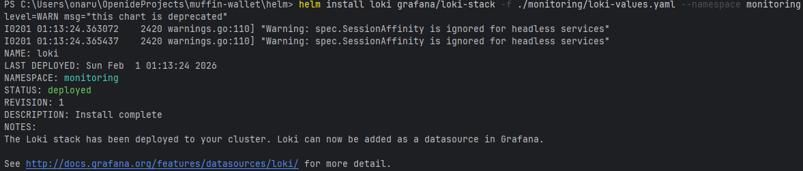
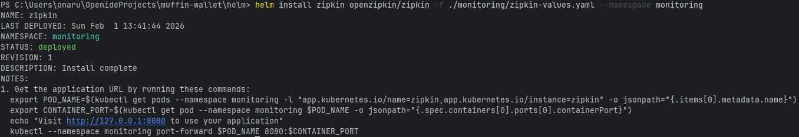
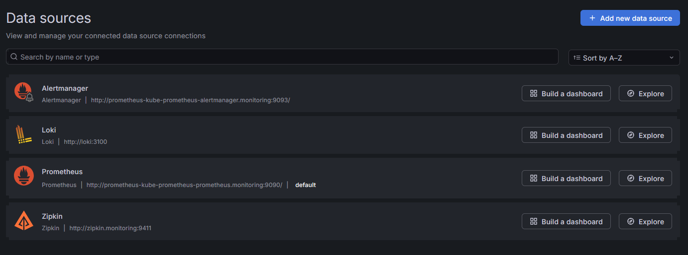

# Muffin wallet

Metrics, logs and traces collection implemented.

Prometheus + Loki + Zipkin with Long-term volumes.

## Tutorial

### Requirements

This setup target is minikube cluster.

Helm utility must be installed.

Minikube also should contain nginx-ingress addon.

We will set long-term persistent volumes for:
- `Prometheus`: `15Gi`, `7d retention`
- `Loki`: `5Gi`
- `Zipkin`: `5Gi`
- `Grafana`: `1Gi`

### Minikube memory extension

It will require at least 26GB of single cluster node data,
but minikube usually allocates less VM memory.
We need to allocate more.

Stop and delete existing cluster.
```shell
minikube stop
minikube delete
```

Allocate 35GB (required + ~10Gi) for minikube and start.
```shell
minikube config set disk-size 35GB
minikube start
```

### Installation

Move to the `/helm` project folder.
Add Prometheus Operator and Loki repositories:
```shell
helm repo add prometheus-community https://prometheus-community.github.io/helm-charts
helm repo add grafana https://grafana.github.io/helm-charts
helm repo add openzipkin https://openzipkin.github.io/zipkin-helm
helm repo update
```

First, install Loki-stack:
```shell
helm install loki grafana/loki-stack -f ./monitoring/loki-values.yaml --namespace monitoring --create-namespace
```
You should see success message:


Secondly, install Zipkin:
```shell
helm install zipkin openzipkin/zipkin -f ./monitoring/zipkin-values.yaml --namespace monitoring
```
You should see success message:


Then, install Prometheus Operator (might be some CRD errors, just repeat):
```shell
helm install prometheus prometheus-community/kube-prometheus-stack -f ./monitoring/prometheus-values.yaml --namespace monitoring
```
You should see success message:


Wait a little and check `monitoring` namespace for pods to initialize:
```shell
kubectl get all -n monitoring
```
You should see successful setup:


Locate to `/local-env` folder and boot up docker-compose like:
```shell
docker compose up
```

Locate back to `/helm` folder. Now install muffin-currency and muffin-wallet Charts:
```shell
helm install muffin-currency .\muffin-currency
helm install muffin-wallet .\muffin-wallet
```
Check default namespace and CRD for successful startup:
```shell
kubectl get all
kubectl get servicemonitor/muffin-wallet -n monitoring
```


### Prometheus

Port-forward Prometheus:
```shell
kubectl port-forward svc/prometheus-kube-prometheus-prometheus 9090:9090 -n monitoring
```
Access it via `http://localhost:9090/targets`. And check whether pods metrics are scraped:


We can see that all pods metrics are scraped.


### Accessing muffin-wallet

Install ingress addon (in case not installed yet):
```shell
minikube addons enable ingress
```

Start tunnel:
```shell
minikube tunnel
```

Add `muffin-wallet.com` as `127.0.0.1` to hosts.
Access Swagger-UI via `http://muffin-wallet.com/swagger-ui/index.html`:


### Grafana

Port-forward Grafana:
```shell
kubectl port-forward svc/prometheus-grafana 3000:80 -n monitoring
```
Access it via `http://localhost:3000/login`. Login with `admin` and `admin` password.

Check datasources, it should contain Loki, Prometheus and Zipkin:


It already contains default dashboards for K8S:

Kubernetes / API server example (takes a while to load):


Custom dashboard for muffin-services is saved as `muffin-services-dashboard.json` and contains following:

Both services:
- Search traces and logs by 'Log level' and 'Trace id'
- Search logs by 'Log level'

Muffin-wallet:
- RPS for each method
- Application errors (4XX and 5XXX)
- 99-percentile of requests execution
- Active connections pool count
- Latest logs

Muffin-currency:
- RPS for each method
- Latest logs

Dashboard preview:


### How to check dashboard

Import `muffin-services-dashboard.json` dashboard into Grafana and check following:
- RPS, 99 percentile, Logs and traces: Open swagger and execute some methods.
- Errors: Disable muffin-currency or execute with unknown wallet to get an error.
- Active connections pool: try to spam multiple transaction requests in parallel.
