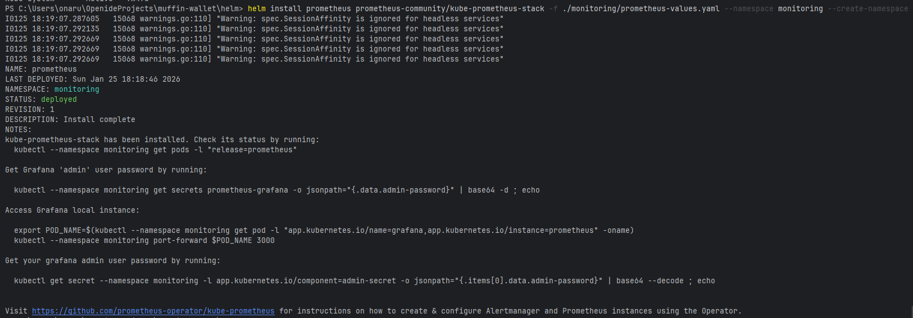
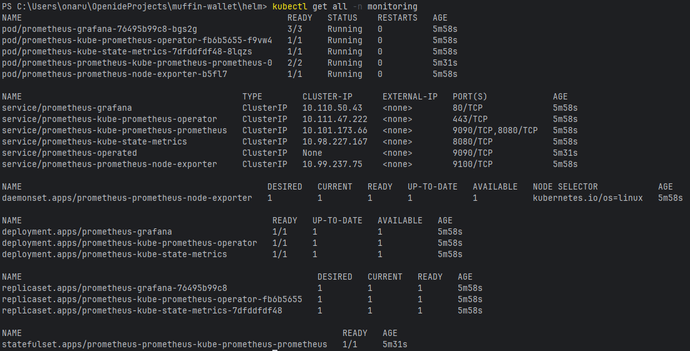
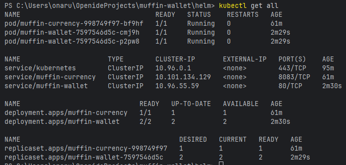
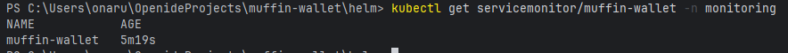
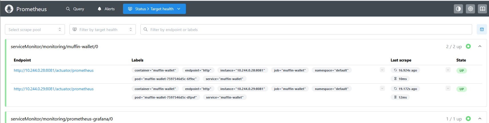
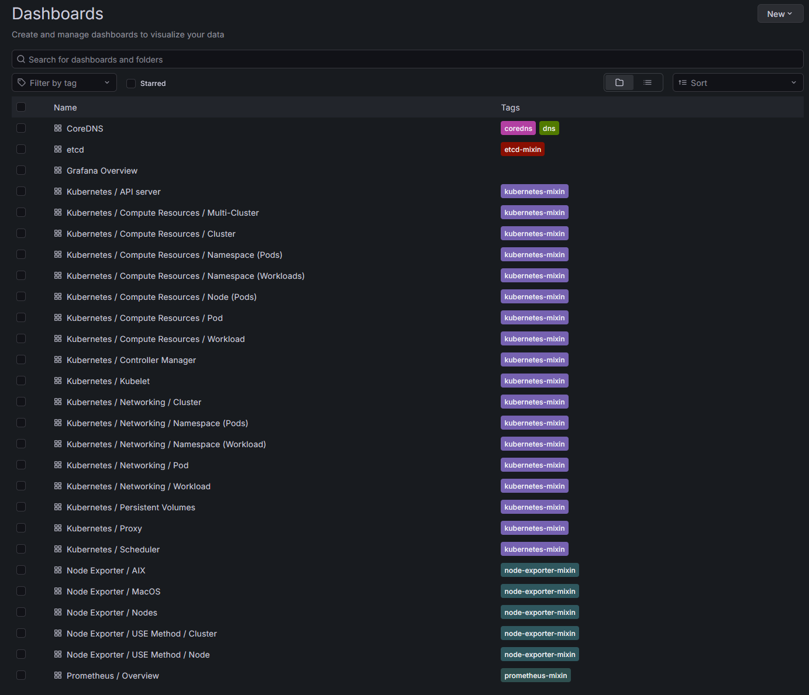
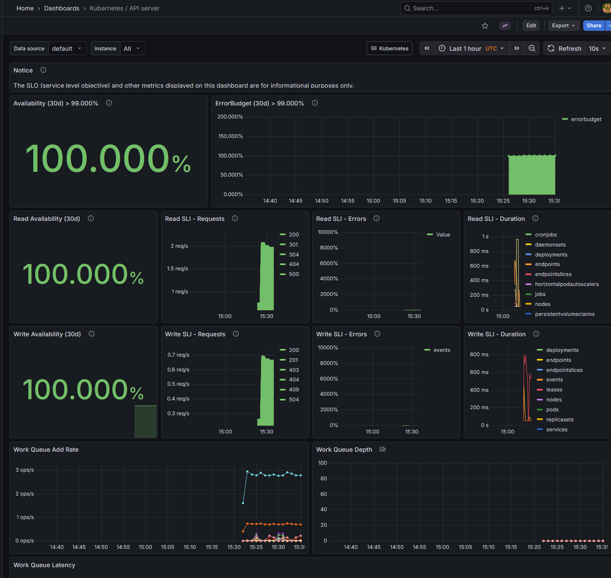
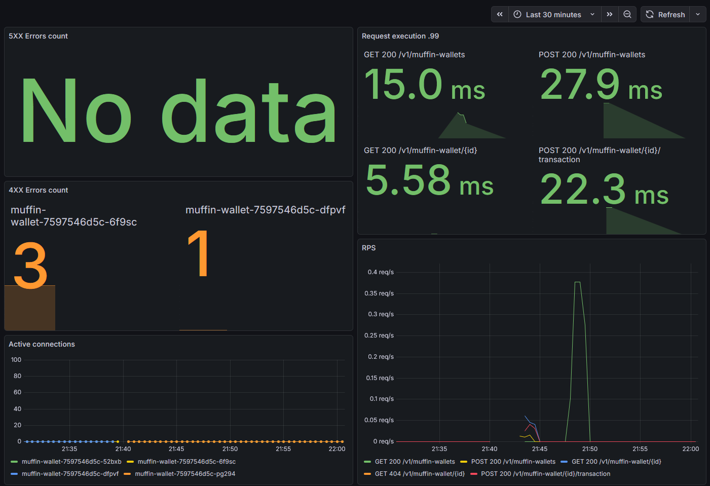

# Muffin wallet

Prometheus Operator with Long-term volume.

## Tutorial


### Requirements

Helm utility must be installed.

This setup target is minikube cluster.
But prometheus can generate lots of data.
We will assume that prometheus requires 20GB for 7d retention
and Grafana requires 5GB for dashboards data.
Thus, it will require at least 25GB of single cluster node data,
but minikube usually allocates less VM memory.
We need to allocate more.

Minikube also should contain nginx-ingress addon.


### Minikube memory extension

Stop and delete existing cluster.
```shell
minikube stop
minikube delete
```

Allocate 35GB (required 25 + extra 10) for minikube and start.
```shell
minikube config set disk-size 35GB
minikube start
```

### Installation

Move to the `/helm` project folder.
Add Prometheus Operator repository:
```shell
helm repo add prometheus-community https://prometheus-community.github.io/helm-charts
helm repo update
```

Install Prometheus Operator:
```shell
helm install prometheus prometheus-community/kube-prometheus-stack -f ./monitoring/prometheus-values.yaml --namespace monitoring --create-namespace
```
You should see success message:


Wait a little and check `monitoring` namespace for pods to initialize:
```shell
kubectl get all -n monitoring
```
You should see successful setup:


Locate to `/local-env` folder and boot up docker-compose like:
```shell
docker compose up
```

Locate back to `/helm` folder. Now install muffin-currency and muffin-wallet Charts:
```shell
helm install muffin-currency .\muffin-currency
helm install muffin-wallet .\muffin-wallet
```
Check default namespace and CRD for successful startup:
```shell
kubectl get all
kubectl get servicemonitor/muffin-wallet -n monitoring
```




### Prometheus

Port-forward Prometheus:
```shell
kubectl port-forward svc/prometheus-kube-prometheus-prometheus 9090:9090 -n monitoring
```
Access it via `http://localhost:9090/targets`. And check whether pods metrics are scraped:


We can see that all pods metrics are scraped.


### Accessing muffin-wallet

Start tunnel:
```shell
minikube tunnel
```

Add `muffin-wallet.com` as `127.0.0.1` to hosts.
Access Swagger-UI via `http://muffin-wallet.com/swagger-ui/index.html`:


### Grafana

Port-forward Grafana:
```shell
kubectl port-forward svc/prometheus-grafana 3000:80 -n monitoring
```
Access it via `http://localhost:3000/login`. Login with `admin` and `admin` password.
It already contains default dashboards for K8S:

Kubernetes / API server example (takes a while to load):


Custom dashboard for muffin-wallet is saved as `muffin-wallet-dashboard.json` and contains:
- RPS for each method
- Application errors (4XX and 5XXX)
- 99-percentile of requests execution
- Active connections pool count

After playing with Rest API via Swagger-UI we can see this:
