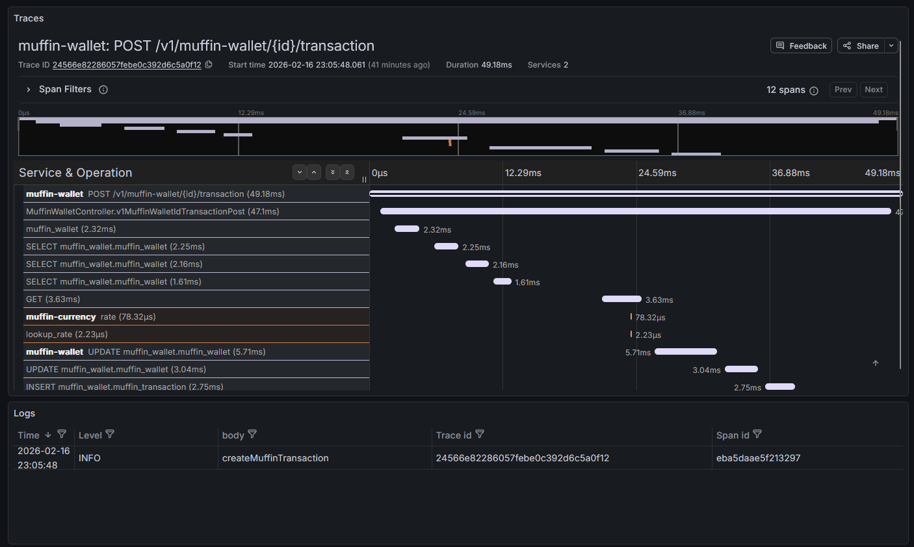
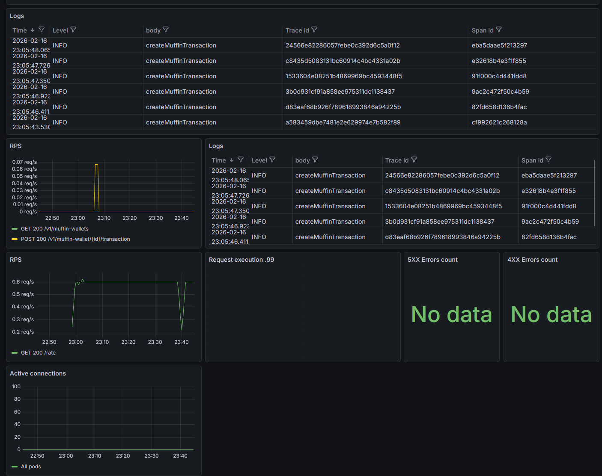

# Open-Telemetry stack

Installation of long-term storage observability stack built on Open-Telemetry.

Stack:
- Open-Telemetry collector (operator) as Telemetry bus
- Grafana (operator) as Visualization component
- Prometheus (operator) as Metrics holder
- Loki as Logs holder
- Tempo as Traces holder

Pvc requirements:
- Open-Telemetry collector 
- Prometheus: 20Gi
- Grafana: 5Gi
- Loki: 10Gi
- Tempo: 10Gi

## Requirements

To setup this stack, following requirements must be met:
- Minimum node memory: 45Gi
- Installed helm
- Installed helmfile

## Installation

Move to `helm` directory.
Execute command:
```shell
helmfile sync
```

### Accessing muffin-wallet

Install ingress addon (in case not installed yet):
```shell
minikube addons enable ingress
```

Start tunnel:
```shell
minikube tunnel
```

Add `muffin-wallet.com` as `127.0.0.1` to hosts.
Access Swagger-UI via `http://muffin-wallet.com/swagger-ui/index.html`:

### Grafana

Port-forward Grafana:
```shell
kubectl port-forward svc/prometheus-operator-grafana 3000:80 -n monitoring
```
Access it via `http://localhost:3000/login`. Login with `admin` and `admin` password.

Dashboard is saved in file `dashboard.json`.

Search by traceId and level:

Main part of dashboard:

